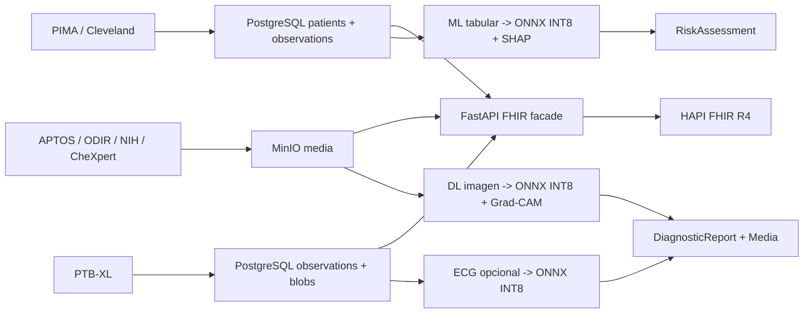
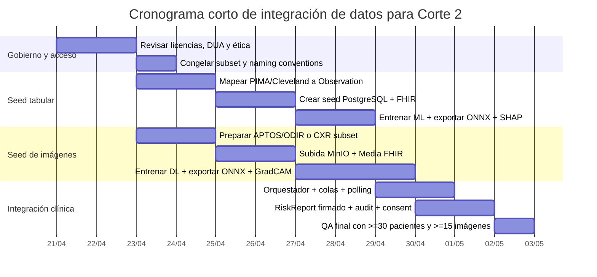

# Datasets recomendados para un Sistema Clínico Digital Interoperable Corte 2

## Resumen ejecutivo

La rúbrica del Corte 2 exige un sistema clínico digital con backend en FastAPI, persistencia en PostgreSQL, almacenamiento de imágenes en MinIO, frontend SPA profesional, interoperabilidad con HL7 FHIR R4, modelos tabulares e imagenológicos cuantizados para CPU en ONNX, explicabilidad con SHAP y Grad-CAM, y una carga mínima operativa de al menos 30 pacientes, de los cuales al menos 15 deben tener imágenes vinculadas. También exige sembrado automático desde datasets reales, no datos inventados. fileciteturn0file0

Bajo esos criterios, la combinación **más práctica y de menor riesgo** para cumplir la rúbrica es un **bundle mínimo** formado por **PIMA Indians Diabetes** para el modelo tabular y **APTOS 2019 Blindness Detection** para el modelo de imágenes de retina. Esa combinación es pequeña o moderada, fácil de convertir a CSV/JPG, fácil de sembrar en PostgreSQL y MinIO, y muy compatible con inferencia CPU usando ONNX Runtime INT8. La advertencia importante es de **proveniencia clínica**: PIMA y APTOS no corresponden a los mismos pacientes reales, así que el enlace paciente-tabular-imagen debe declararse como **paciente sintético compuesto a partir de datasets reales**, lo cual sí es consistente con la lógica de siembra descrita en la rúbrica. citeturn18search5turn30search1turn11search1turn26search0

Si el equipo quiere mayor realismo hospitalario y mejor trazabilidad FHIR, la mejor ruta “avanzada” es **MIMIC-IV + MIMIC-CXR-JPG**: ambos comparten `subject_id`, tienen una guía oficial de mapeo a FHIR, y permiten modelar Patient, Encounter, Observation, DiagnosticReport y Media con menos arbitrariedad. Sin embargo, exigen acceso credencializado, firma de DUA, entrenamiento CITI y una huella de almacenamiento mucho mayor; por eso son excelentes para una versión madura del sistema, pero no son la opción de menor riesgo para llegar bien al entregable del corte. citeturn5view0turn6view0turn5view1turn6view2turn23view0

En términos de prioridad para este proyecto, la recomendación es: **alta prioridad** para PIMA, Heart Disease Cleveland, APTOS 2019, ODIR-5K y PTB-XL; **prioridad media** para NIH ChestXray14, CheXpert, MIMIC-IV, MIMIC-CXR-JPG y HAM10000; **prioridad baja** para LIDC-IDRI y CAMELYON16 debido a su complejidad volumétrica, almacenamiento elevado y mayor fricción operacional en un entorno sin GPU. citeturn5view8turn5view3turn20search10turn31search9turn13search0turn27search2

## Alineación con la rúbrica y criterios de selección

La selección de datasets no debe hacerse solo por popularidad académica. Debe maximizar cinco objetivos simultáneos: **facilidad de siembra**, **calidad de mapeo FHIR**, **viabilidad de ONNX INT8 en CPU**, **explicabilidad**, y **cumplimiento mínimo del flujo clínico exigido por la rúbrica**. En otras palabras, el dataset ideal para este corte no es necesariamente el más grande, sino el que mejor se deja convertir en Patient + Observation + Media + DiagnosticReport + RiskAssessment dentro de un sistema funcional. fileciteturn0file0

La arquitectura FHIR del proyecto favorece datasets que puedan separarse limpiamente en: identidad sintética o pseudonimizada del paciente, observaciones cuantitativas o categóricas, objeto multimedia, y etiqueta clínica que pueda representarse como diagnóstico, hallazgo o predicción de riesgo. La especificación FHIR R4 posiciona Observation como recurso central para mediciones y hallazgos, mientras que DiagnosticReport y RiskAssessment sirven para resultados agregados y estratificación de riesgo; el ecosistema MIMIC ya publica una guía de mapeo real a FHIR que es especialmente útil como patrón de diseño. citeturn25search2turn23view0

En terminología, la recomendación práctica es usar **LOINC** para pruebas, signos y mediciones observacionales, y **SNOMED CT** para diagnósticos y hallazgos clínicos. LOINC se define oficialmente como estándar internacional para identificar mediciones, observaciones y documentos de salud, y SNOMED CT dispone de navegadores oficiales —incluida interfaz en español— para seleccionar conceptos diagnósticos consistentes. citeturn24search2turn24search25turn24search3turn24search15turn24search23

Para la ejecución sin GPU, **ONNX Runtime** soporta cuantización a 8 bits mediante flujos estáticos y dinámicos, lo que hace especialmente favorables los modelos tabulares clásicos, las CNN compactas 2D para retina o radiografía, y los modelos 1D para ECG. En cambio, CT 3D y patología WSI exigen patching, tiling, feature extraction o precomputación, lo que baja su prioridad para un corte con foco en integración end-to-end. citeturn26search0turn26search10turn31search9turn31search13



El diagrama resume la recomendación operativa: **datos estructurados a PostgreSQL**, **medios a MinIO**, **FHIR como capa de interoperabilidad**, y **microservicios ONNX cuantizados** para inferencia y explicabilidad. Esa partición encaja directamente con la arquitectura pedida por la rúbrica. fileciteturn0file0

## Tabla comparativa de los 12 datasets priorizados

| Dataset | Tipo de dato | Modalidad principal | Tamaño muestral | Formatos típicos | Acceso / licencia / restricciones | Estado de identificadores | Ajuste a FHIR y ONNX | Prioridad |
|---|---|---|---:|---|---|---|---|---|
| **PIMA Indians Diabetes** citeturn18search5turn18search0 | Tabular | Labs / riesgo metabólico | 768 filas | CSV | Portal accesible vía Kaggle; origen UCI/NIDDK; licencia explícita no visible en el espejo público | Sin identificadores directos | Excelente para Observation + RiskAssessment y ONNX tabular | **Alta** |
| **Heart Disease Cleveland** citeturn5view8 | Tabular | Cardiología | 303 casos | CSV / texto tabular | UCI; licencia específica no expuesta en la ficha | Nombres y SSN eliminados, dummy values | Excelente para Observation + Condition + RiskAssessment | **Alta** |
| **MIMIC-IV** citeturn5view0turn6view0turn23view0 | Tabular EHR | Demografía, labs, diagnósticos, órdenes | 364,627 individuos en v3.0 | CSV | Acceso credencializado, DUA y CITI obligatorios | Desidentificado con date-shift y anchor years | Excelente para FHIR real; más pesado para el corte | **Media** |
| **MIMIC-CXR-JPG** citeturn5view1turn6view2turn22view2 | Imágenes + labels | Chest X-ray | 377,110 imágenes / 227,827 estudios | JPG + CSV gzip | Acceso credencializado, DUA y CITI | PHI removida; `subject_id` y `study_id` pseudonimizados | Excelente con Media + DiagnosticReport; almacenamiento alto | **Media** |
| **CheXpert** citeturn5view2turn7search1turn20search10turn7search5 | Imágenes + reportes | Chest X-ray | 224,316 radiografías / 65,240 pacientes | JPEG + CSV | Research Use Agreement; uso no comercial | Desidentificado | Muy bueno para DL 2D; menos directo para seed clínico completo | **Media** |
| **NIH ChestXray14** citeturn5view9turn28search9turn4search8 | Imágenes + labels | Chest X-ray | 112,120 imágenes / 30,805 pacientes | PNG y también DICOM en Google Cloud | Sin restricciones de uso, pero con atribución obligatoria | Desidentificado | Bueno para DL 2D y FHIR Media; labels débiles | **Media** |
| **APTOS 2019** citeturn11search1turn30search1turn12search16 | Imágenes | Retina / fondo de ojo | 3,662 train; test privado ~13,000 imágenes | PNG/JPG + CSV | Kaggle competition terms; revisar redistribución | No expone identificadores directos | Excelente para DL 2D, Grad-CAM y seed sencillo en MinIO | **Alta** |
| **ODIR-5K** citeturn29search0turn29search4turn29search9 | Multimodal ligero | Retina + metadatos | 5,000 pacientes | Imágenes + `data.xlsx`/tabla | Portal/competencia; licencia pública no claramente visible en snippet | “Patient identifying information will be removed” | Muy bueno para Media + Observation; mejor coherencia demo que APTOS | **Alta** |
| **PTB-XL** citeturn5view3turn21view1turn6view4 | Señales + metadata | ECG 12 derivaciones | 21,799 ECG / 18,869 pacientes | WFDB `.dat/.hea` + CSV | Abierto bajo CC BY 4.0 | Pseudonimizado; fechas desplazadas | Excelente para Observation SampledData y ONNX 1D | **Alta** |
| **LIDC-IDRI** citeturn31search9turn8search0turn31search12 | Imágenes 3D | CT torácico | 1,018 casos | DICOM + XML | Acceso abierto TCIA; verificar políticas de uso de colección | Desidentificado | Muy bueno para CT/FHIR ImagingStudy; costoso sin GPU | **Baja** |
| **HAM10000** citeturn5view6turn17search16turn17search3 | Imágenes | Dermatoscopía | 10,015 imágenes | JPEG + metadata | Licenciamiento CC BY-NC en agregados ISIC 2018; uso académico/no comercial | Sin identificadores directos | Bueno para DL y MinIO; menos alineado con hospital general | **Media** |
| **CAMELYON16** citeturn13search0turn16search1turn27search2turn31search13 | Imágenes WSI | Patología | 400 WSI | TIFF/WSI | CC0 reportado en documentación derivada; descarga oficial Grand Challenge | Desidentificado | Excelente para patología, pero inviable como full-res sin prefeatures | **Baja** |

## Bundle mínimo recomendado

El **bundle mínimo recomendado** para llegar al corte con la mejor relación entre simplicidad, demostrabilidad y cumplimiento es:

**Bundle base**  
**PIMA Indians Diabetes + APTOS 2019 Blindness Detection**

La lógica de este bundle es fuerte por tres razones. Primero, PIMA permite construir en pocas horas un pipeline tabular completo con imputación, escalado, entrenamiento de un modelo clásico, exportación a ONNX y explicación SHAP. Segundo, APTOS permite levantar un pipeline de imágenes con una CNN pequeña, exportación a ONNX, cuantización INT8 y Grad-CAM sin necesidad de 3D ni DICOM. Tercero, ambos datasets son suficientemente grandes para sembrar un subconjunto pequeño y totalmente demostrable —por ejemplo, 30 pacientes con 15 imágenes— y aun así conservar un holdout razonable para probar el pipeline. citeturn18search5turn11search1turn30search1turn26search0

La limitación metodológica es que el tabular y la imagen no vienen de los mismos sujetos. Por eso, en el seed debe declararse explícitamente que cada paciente de la demo es un **registro sintético compuesto** creado a partir de una fila tabular real y, cuando corresponda, de una imagen real de otro dataset. Esto no invalida el proyecto para el corte porque la rúbrica, en la sección de estrategia de datos, justamente plantea convertir filas de datasets en pacientes FHIR y vincular imágenes del dataset DL a los mismos pacientes sembrados. fileciteturn0file0

**Bundle alternativo con mejor coherencia semántica**  
**ODIR-5K + PIMA** o **ODIR-5K solo en modo multimodal ligero**

ODIR-5K aporta 5,000 pacientes con edad, sexo, diagnósticos y fotografías de ambos ojos, lo que mejora la coherencia paciente-imagen frente a APTOS. Si el equipo quiere una demo más “clínicamente consistente”, ODIR-5K puede ser mejor semilla para Patient + Observation + Media. Aun así, su señal tabular es menos rica que PIMA para un modelo clásico interpretable, así que PIMA sigue siendo superior para el microservicio tabular. citeturn29search0turn29search4turn29search9

**Bundle avanzado de mayor realismo hospitalario**  
**MIMIC-IV + MIMIC-CXR-JPG**

Este bundle es el mejor desde la óptica de interoperabilidad real, porque une EHR tabular y radiografías por `subject_id`, y además existe una guía oficial MIMIC-on-FHIR para orientar los mapeos. La contracara es el costo operativo: credenciales, DUA, mayor volumen y más trabajo ETL. Para un corte con restricción de tiempo, conviene usarlo si el equipo ya tiene acceso concedido. citeturn5view0turn5view1turn23view0turn6view0turn6view2

## Perfiles analíticos de los datasets recomendados

**PIMA Indians Diabetes.** Fuente accesible vía entity["company","Kaggle","data science platform"] y de origen histórico en la UCI; el resumen estadístico clásico reporta **768 instancias** y **8 variables predictoras**. Es tabular puro, normalmente en CSV, sin identificadores directos. La etiqueta disponible es binaria (`Outcome`). Preprocesamiento típico: tratar como faltantes los ceros biológicamente imposibles en glucosa, presión diastólica, grosor cutáneo, insulina y BMI; imputación; escalado estándar o robusto; y calibración de probabilidades. En FHIR, cada fila puede sembrarse como Patient sintético y las variables como Observation; el resultado del modelo entra como RiskAssessment y, si el médico firma, como parte de un RiskReport persistido. En terminología, conviene usar LOINC para glucosa, IMC y presión arterial cuando corresponda, y SNOMED CT para el hallazgo “diabetes mellitus” o “riesgo de diabetes”. Su costo computacional es trivial —segundos de entrenamiento CPU— y su ajuste a ONNX cuantizado es excelente, especialmente con regresión logística, árboles o boosting exportado a ONNX. Éticamente, el dataset es antiguo y poblacionalmente sesgado hacia mujeres Pima; debe explicitarse que no es representativo universal. citeturn18search5turn18search3turn24search2turn24search3turn26search10

**Heart Disease Cleveland.** La ficha de la UCI reporta que el conjunto tiene **76 atributos** en la base completa, aunque la práctica habitual usa **14**, y que el subconjunto de Cleveland es el más empleado; además, la página indica que nombres y números de seguridad social fueron retirados y reemplazados por valores dummy. Eso lo vuelve muy cómodo para seed clínico docente. Los datos son tabulares; la etiqueta puede binarizarse a presencia/ausencia de enfermedad. El preprocesamiento típico consiste en imputar faltantes, codificar variables categóricas como `cp`, `thal` y `slope`, normalizar continuas y calibrar si el modelo produce scores poco bien calibrados. FHIR encaja bien: age, trestbps, chol y otros pueden ir a Observation; el resultado clínico puede ir a Condition y la predicción a RiskAssessment. Para ONNX INT8 en CPU es una de las mejores opciones del listado. Como sesgo ético, el dataset es pequeño y antiguo, por lo que sirve mejor como demostración ingenieril que como base clínica realista. citeturn5view8turn24search2turn24search3turn26search10

**MIMIC-IV.** Mantenido por el ecosistema de entity["organization","PhysioNet","research data platform"] y el entity["organization","MIT Laboratory for Computational Physiology","mimic maintainer"], MIMIC-IV es el mejor dataset tabular del listado para emular un HIS real. La versión reciente describe **364,627 individuos únicos**, **546,028 hospitalizaciones** y **94,458 estancias UCI** en v3.0, con datos de labs, diagnósticos, procedimientos, medicación y más. Está desidentificado, con un desplazamiento temporal por paciente y `anchor_year`, y solo puede descargarse con acceso credencializado, DUA y entrenamiento CITI. En FHIR, su valor es sobresaliente porque existe una guía oficial MIMIC-on-FHIR que ya modela Patient, Encounter, Observation y otros perfiles. Para seed en PostgreSQL, la mejor táctica no es cargar el universo completo sino extraer 30–500 pacientes con sus tablas relacionadas y sembrarlos por lotes. En MinIO no necesitas almacenar nada salvo medios derivados; el grueso queda en PostgreSQL. ONNX cuantizado es factible para el componente tabular, pero el ETL manda mucho más que el modelado. Éticamente, aunque está desidentificado, sigue siendo dato clínico sensible y sujeto a DUA estricto. citeturn5view0turn6view0turn22view3turn23view0

**MIMIC-CXR-JPG.** Derivado de MIMIC-CXR y publicado en PhysioNet, contiene **377,110 imágenes JPG** y **227,827 estudios**; la metadata incluye `subject_id`, `study_id` y `dicom_id`, y el set trae CSV comprimidos con labels tipo CheXpert/NegBio. Está desidentificado conforme a HIPAA Safe Harbor y requiere el mismo régimen de acceso credencializado que MIMIC. Para un HIS interoperable, es de los mejores datasets disponibles porque permite sembrar Media con llave MinIO basada en `subject_id/study_id/dicom_id.jpg`, y a la vez generar DiagnosticReport y Observation/Condition derivados de los hallazgos estructurados. Técnicamente conviene no descargar el dataset completo: usar el archivo de splits y filenames para una descarga parcial de 15–500 estudios es suficiente para el corte. ONNX INT8 en CPU funciona bien con arquitecturas compactas 2D; el problema principal no es inferencia, sino almacenamiento. Éticamente, aunque el PHI fue removido, sigue sujeto a DUA y no debe redistribuirse. citeturn5view1turn22view1turn22view2turn6view2turn15search8

**CheXpert.** Publicado por entity["organization","Stanford AIMI","stanford medicine ai center"], CheXpert contiene **224,316 radiografías de tórax** de **65,240 pacientes**. La documentación secundaria estructurada del dataset indica que las imágenes se distribuyen en **JPEG**, con una versión **small** de ~**11 GB** y una versión **large** de ~**440 GB**. Los labels abarcan 14 observaciones, con manejo explícito de incertidumbre. Para FHIR, encaja en Media e Idealmente DiagnosticReport con `conclusionCode` SNOMED, mientras que la incertidumbre puede conservarse como extensión o probabilidad en RiskAssessment si quieres reutilizar el score para un flujo de alerta. En términos legales, Stanford indica Research Use Agreement y restricción a usos no comerciales. Mi recomendación para este corte es usarlo solo si el equipo ya tiene el acceso resuelto o si opta por la versión small. citeturn5view2turn7search1turn20search10turn7search5turn7search8

**NIH ChestXray14.** La documentación pública de acceso del dataset indica imágenes de tórax desidentificadas en **PNG**, accesibles desde el sitio de descarga NIH y también vía Google Cloud, con una política de uso sin restricciones pero con requerimientos de atribución al NIH Clinical Center y al paper correspondiente. Los espejos y papers suelen citar alrededor de **112,120 imágenes** y **30,805 pacientes**, mientras la documentación de Google lo resume como “100,000 de-identified images”, por lo que conviene documentar el número exacto de la copia usada. Para este proyecto, es útil cuando quieres un radiológico abierto, sin credenciales complejas, y suficientemente grande para armar subset propio. FHIR: Media + DiagnosticReport. Preprocesamiento: resize, normalización, manejo de multilabel, y opcionalmente filtrado a tareas binarias como neumonía o derrame. ONNX INT8 en CPU es perfectamente viable con MobileNet/EfficientNet pequeños. La bandera metodológica es que sus labels son débiles o text-mined y, por tanto, menos confiables que un consenso radiológico manual. citeturn5view9turn4search8turn28search9turn28search0

**APTOS 2019 Blindness Detection.** El reto de Kaggle describe un conjunto grande de imágenes de retina tomadas por fundus photography, con cada imagen puntuada por un clínico en una escala de **0 a 4** para severidad de retinopatía diabética; distintas referencias académicas citan **3,662 imágenes** de entrenamiento. La estructura típica trae `train.csv` más imágenes, y el portal indica además un test privado voluminoso. Para este proyecto, APTOS es probablemente la mejor opción simple de retina: permite sembrar 15 imágenes en MinIO en minutos, crear Media por paciente, ejecutar inferencia DL 2D y adjuntar Grad-CAM como otro objeto en MinIO o como `presentedForm`/Media adicional. Técnicamente, la rutina estándar es recorte circular del fondo de ojo, CLAHE opcional, resize a 224–384 px, normalización y balanceo o focal loss por desbalance de clases. Legalmente, hay que revisar cuidadosamente las reglas/terms de Kaggle antes de redistribuir cualquier copia; por eso lo recomiendo para uso docente interno y no para empaquetar la data dentro del repositorio final. citeturn12search16turn11search1turn30search1turn12search0

**ODIR-5K.** ODIR-5K reporta **5,000 pacientes** con edad, sexo, imágenes de fondo de ojo izquierdo y derecho y palabras clave diagnósticas del médico; la descripción pública añade que la identificación del paciente fue removida y que el dataset sigue reglas éticas y de privacidad de China. En paquetes distribuidos por la comunidad suele aparecer un `data.xlsx` con columnas como `Patient Age`, `Patient Sex`, `Left-Fundus`, `Right-Fundus` y etiquetas diagnósticas. Para este proyecto es muy atractivo porque ofrece, dentro de un mismo universo, imagen y metadata ligera, lo que reduce la arbitrariedad del seed. En FHIR, `Patient Age/Sex` alimenta Patient/Observation, las fotos van a Media y los diagnósticos a Condition o DiagnosticReport; si quieres mantener una predicción de riesgo para el flujo del corte, puedes derivarla a RiskAssessment. ONNX INT8 es adecuado con CNN compacta o incluso con dos vistas concatenadas. La bandera legal es que la licencia pública no aparece claramente en los snippets consultables; por eso hay que registrar en el README la fuente exacta descargada y no asumir redistribución libre. citeturn29search4turn29search0turn29search9

**PTB-XL.** Este dataset de ECG, también en PhysioNet, contiene **21,799 ECGs** de **18,869 pacientes**, en formato **WFDB** (`.dat/.hea`) con metadata tabular en `ptbxl_database.csv`, sampling a 500 Hz y versión downsampled a 100 Hz; el acceso es abierto bajo **CC BY 4.0**. Además, la documentación oficial indica que nombres de validadores, sitio de registro y otros campos personales fueron pseudonimizados, que las fechas fueron desplazadas por paciente y que edades mayores de 89 se colapsan según reglas HIPAA. Es excelente para enriquecer el HIS con una modalidad de señales: puedes mapear cada ECG a Observation con `valueSampledData`, derivar el resumen a DiagnosticReport, y guardar el archivo crudo opcionalmente en MinIO si quieres descarga cliente-side. Para ONNX INT8, un 1D-CNN pequeño funciona bien en CPU. No es obligatorio para cumplir la rúbrica, pero sí aporta una dimensión “hospitalaria” muy valiosa. citeturn5view3turn21view1turn21view3turn6view4

**LIDC-IDRI.** La colección LIDC-IDRI de entity["organization","The Cancer Imaging Archive","medical imaging archive"] contiene **1,018 CT torácicos** con anotaciones radiológicas en XML; la documentación y literatura remarcan que se trata de datos retrospectivos aprobados por IRB y desidentificados. Es de altísimo valor para flujos FHIR con ImagingStudy, Media, DiagnosticReport e incluso segmentaciones derivadas, pero para este corte tiene dos desventajas importantes: la naturaleza 3D del CT y el almacenamiento, que en tutoriales y tooling de terceros se cita en torno a **100–125 GB** para la colección completa. Sin GPU, la ruta razonable sería usar un enfoque slice-based o descargar una microcohorte muy pequeña. Lo considero ideal para una extensión posterior, no para el bundle mínimo. citeturn31search9turn8search0turn31search12turn8search15

**HAM10000.** El paper del dataset reporta **10,015 imágenes dermatoscópicas**, con más de la mitad confirmadas por patología y el resto por seguimiento, consenso experto o microscopía confocal; el acceso histórico se realiza por el entity["organization","ISIC Archive","skin imaging archive"] y agregados ISIC 2018/2019 se publican con licenciamiento **CC BY-NC**. Técnicamente es un dataset muy amigable para CNN 2D, Grad-CAM y despliegue ONNX CPU. En FHIR, cada imagen corresponde naturalmente a Media y el diagnóstico a Condition/DiagnosticReport. Aun así, lo priorizo por debajo de retina y tórax porque su relación con el caso de “sistema hospitalario general interoperable” es algo menos directa, salvo que el equipo quiera un servicio específico de dermatología. citeturn5view6turn17search0turn17search16turn17search3

**CAMELYON16.** El sitio del challenge reporta **400 WSI** de ganglio centinela, y la documentación derivada usada por la comunidad cita alrededor de **900 GB** para el dataset completo antes de extracción de features. Es un dataset de patología excelente para localización y clasificación de metástasis, pero, a diferencia de APTOS o CheXpert, exige una estrategia de tiles o prefeatures; no es realista tratarlo como “subo imágenes al bucket y corro un EfficientNet” si no quieres sobredimensionar el proyecto. Mi recomendación es usarlo solo si vas a trabajar con embeddings o parches preextraídos, no con slides completos. En FHIR, las slides y parches pueden modelarse como Media y el resultado agregado como DiagnosticReport. Su atractivo principal es la modalidad de patología; su desventaja es la complejidad operativa. citeturn13search0turn16search1turn31search13turn27search2

## Ingesta técnica y mapeo a FHIR, PostgreSQL y MinIO

La estrategia de seed más robusta es implementar un **adaptador por dataset** con una interfaz común:

1. `load_records()` devuelve filas clínicas y/o referencias a archivos.  
2. `normalize_record()` transforma el registro a un esquema interno.  
3. `create_patient_bundle()` produce Patient, Observation, Media y etiquetas clínicas.  
4. `persist_bundle()` escribe PostgreSQL, sube binarios a MinIO y publica o espeja a HAPI FHIR.  

Ese patrón reduce el trabajo repetido y además facilita el testing. Para la semántica FHIR, conviene inspirarse en la guía MIMIC-on-FHIR y usar como principio general: **Patient para identidad**, **Observation para medidas/tablas/señales**, **Media para binarios visuales**, **DiagnosticReport para conclusiones diagnósticas**, **RiskAssessment para scores/calibración**, y **AuditEvent/Consent** para trazabilidad y Habeas Data. citeturn23view0turn25search2

### Esqueleto recomendado de `seed_patients.py`

```python
# scripts/seed_patients.py
# Uso: python scripts/seed_patients.py --adapter pima --limit 30 --images-from aptos --image-limit 15

from adapters import (
    PimaAdapter, HeartAdapter, MimicIvAdapter, MimicCxrAdapter,
    CheXpertAdapter, NihCxrAdapter, AptosAdapter, OdirAdapter,
    PtbxlAdapter, LidcAdapter, HamAdapter, CamelyonAdapter
)
from services import pg, minio, fhir
from faker import Faker

faker = Faker("es_CO")

def synthetic_patient(record):
    return {
        "resourceType": "Patient",
        "name": [{"text": faker.name()}],
        "gender": record.get("gender") or faker.random_element(["male", "female"]),
        "birthDate": record.get("birth_date") or str(faker.date_of_birth(minimum_age=18, maximum_age=89)),
        "extension": [{"url": "urn:local:source-dataset", "valueString": record["source_dataset"]}],
    }

def seed_record(record):
    patient = synthetic_patient(record)
    patient_id = pg.insert_patient(patient, source_uid=record["source_uid"])
    fhir.upsert("Patient", patient_id, patient)

    for obs in record.get("observations", []):
        obs["subject"] = {"reference": f"Patient/{patient_id}"}
        pg.insert_observation(patient_id, obs)
        fhir.create("Observation", obs)

    for media in record.get("media", []):
        obj_key = minio.put_object(media["bucket"], media["key"], media["local_path"], media["content_type"])
        media_resource = media["fhir"]
        media_resource["subject"] = {"reference": f"Patient/{patient_id}"}
        media_resource["content"] = {"url": minio.presign(obj_key), "contentType": media["content_type"]}
        pg.insert_image(patient_id, obj_key, media["modality"])
        fhir.create("Media", media_resource)

    if record.get("label"):
        report = record["label"].to_diagnostic_report(patient_id)
        risk = record["label"].to_risk_assessment(patient_id)
        pg.insert_label_objects(patient_id, report, risk)
        fhir.create("DiagnosticReport", report)
        fhir.create("RiskAssessment", risk)

def main(adapter, limit):
    for record in adapter.load_records(limit=limit):
        seed_record(record)
```

### Comandos o pseudocomandos sugeridos por dataset

```bash
# Tabular puro
python scripts/seed_patients.py --adapter pima --csv data/pima/diabetes.csv --limit 30
python scripts/seed_patients.py --adapter heart --csv data/cleveland/processed.cleveland.data --limit 30

# EHR realista
python scripts/seed_patients.py --adapter mimiciv --root data/mimiciv --subject-limit 100 --tables patients,labevents,diagnoses_icd
python scripts/seed_patients.py --adapter mimiciv-demo --root data/mimiciv-demo --subject-limit 30

# Imágenes de tórax
python scripts/seed_patients.py --adapter mimic-cxr --root data/mimic-cxr-jpg --study-limit 50
python scripts/seed_patients.py --adapter chexpert --root data/chexpert-small --study-limit 50
python scripts/seed_patients.py --adapter nih-cxr --root data/nih-chestxray14 --image-limit 200

# Retina
python scripts/seed_patients.py --adapter aptos --root data/aptos2019 --image-limit 30
python scripts/seed_patients.py --adapter odir --root data/odir5k --patient-limit 30

# Señales
python scripts/seed_patients.py --adapter ptbxl --root data/ptb-xl --patient-limit 30 --store-waveforms minio

# CT y patología
python scripts/seed_patients.py --adapter lidc --root data/lidc-idri --case-limit 10 --slice-policy representative
python scripts/seed_patients.py --adapter ham10000 --root data/ham10000 --image-limit 30
python scripts/seed_patients.py --adapter camelyon16 --root data/camelyon16 --slide-limit 10 --tile-size 256 --max-tiles 50
```

### Mapeo práctico a PostgreSQL y MinIO por dataset

Para **PIMA** y **Heart Disease Cleveland**, la regla es simple: una fila por paciente, columnas numéricas a tabla `observations`, variables categóricas a `observations` codificadas o a extensiones, y predicción a `risk_reports`. No se necesita MinIO salvo que guardes SHAP plots. Para **MIMIC-IV**, conviene usar `source_subject_id`, `source_hadm_id` y `source_itemid` como llaves de trazabilidad en columnas auxiliares; eso te permitirá espejar tanto PostgreSQL relacional como recursos FHIR más tarde. Para **MIMIC-CXR-JPG**, **CheXpert**, **NIH**, **APTOS**, **ODIR**, **HAM10000** y **CAMELYON16**, el patrón es: la imagen va a MinIO con clave estable (`patients/{patient_uuid}/{dataset}/{file}`) y el metadato va a PostgreSQL y Media. Para **PTB-XL**, puedes guardar el WFDB original en MinIO y una versión resumida o downsampled en PostgreSQL como blob o ruta. Para **LIDC-IDRI**, evita guardar DICOM completos en la demo inicial: mejor extraer slices PNG representativos o nódulos recortados, y dejar los DICOM íntegros para una segunda fase. citeturn22view1turn21view1turn21view3turn30search1turn29search9turn20search10turn31search12turn31search13

### Timeline recomendado de integración



## Fuentes primarias prioritarias y banderas éticas

La jerarquía de fuentes que conviene privilegiar en este proyecto es: **sitios oficiales del dataset**, luego **papers fundacionales del dataset**, y solo después **espejos o wrappers comunitarios**. En la práctica, eso significa priorizar a la entity["organization","University of California, Irvine","machine learning repository"] para los datasets clásicos tabulares, a entity["organization","PhysioNet","research data platform"] y su ecosistema MIMIC/PTB-XL para EHR, CXR y señales, a entity["organization","Stanford AIMI","stanford medicine ai center"] para CheXpert, a entity["organization","National Institutes of Health","us biomedical agency"] para ChestXray14, a entity["organization","The Cancer Imaging Archive","medical imaging archive"] para LIDC-IDRI, y al entity["organization","ISIC Archive","skin imaging archive"] para HAM10000. Para patología y retos oftalmológicos, Grand Challenge y Kaggle son a menudo el punto oficial de acceso público, pero su licencia debe revisarse caso por caso. citeturn5view8turn5view0turn5view1turn5view3turn5view2turn5view9turn8search0turn17search3turn13search0turn12search0

Las **banderas éticas y legales** más importantes son cuatro. La primera es **uso no comercial o research-only**, muy clara en CheXpert y en agregados ISIC/HAM10000, y operativamente presente en muchos portales Kaggle/Grand Challenge. La segunda es **acceso credencializado bajo DUA**, central en MIMIC-IV y MIMIC-CXR-JPG. La tercera es **desidentificación no equivalente a ausencia de riesgo**: MIMIC, PTB-XL y TCIA están desidentificados o pseudonimizados, pero siguen siendo datos clínicos sensibles. La cuarta es la **validez externa**: datasets antiguos, débiles o de una población muy sesgada no deben presentarse como modelo clínico universal. Para el entregable, la mejor práctica es incluir en el README una “tabla de procedencia y licencia” y en el frontend un disclaimer de uso académico/no diagnóstico. citeturn6view0turn6view2turn6view4turn17search16turn7search5turn8search15

En español, no abundan las fuentes primarias de datasets, pero sí hay recursos útiles de terminología e implementación, como el navegador oficial español de SNOMED CT y ejemplos/reglas de FHIR R4 en implementaciones hispanohablantes. Úsalos como apoyo para nomenclatura y validación semántica, no como reemplazo de la documentación oficial del dataset. citeturn24search23turn24search9

La conclusión operativa es simple: **si necesitas maximizar probabilidad de entrega exitosa**, usa **PIMA + APTOS**; **si quieres una demo más coherente paciente-imagen**, considera **ODIR-5K**; **si ya tienes acceso y quieres construir algo más cercano a un hospital real**, tu mejor norte es **MIMIC-IV + MIMIC-CXR-JPG**. Para todos los demás datasets, el criterio correcto no es “¿se puede entrenar un modelo?”, sino “¿se puede convertir limpiamente en un flujo clínico FHIR, correr en CPU cuantizado, explicarse con SHAP/Grad-CAM y auditarse dentro del sistema?” Esa es la pregunta que mejor alinea la investigación de datos con la rúbrica del Corte 2. fileciteturn0file0